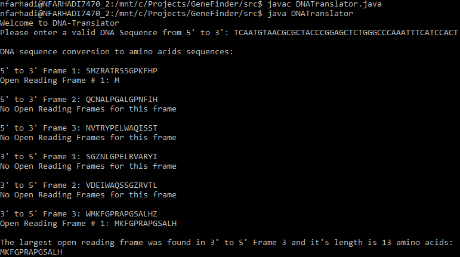

## DNA-Translator

### About
DNA-Translator is a Java 8 console application that converts DNA sequences to amino acid sequences. From the amino acid sequence the primary structure of the protein is defined. Using the application, you can pass in a DNA sequence from 5' to 3' and get back all possible open reading frames and amino acid sequences for that particular DNA sequence.

To run, make sure you have JDK 8 installed. Compile the application with `javac` and run with `java`.

This project was a class project for ECS 129 at UC Davis in winter quarter of 2016.

### Example
